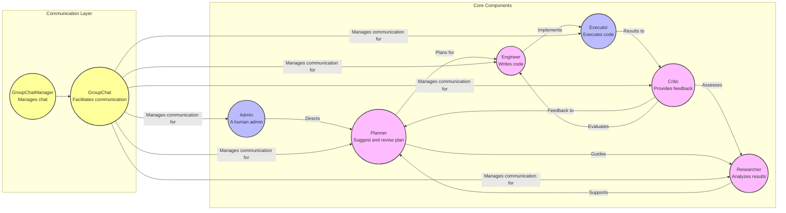

## JourneyCraftAI
JourneyCraftAI is an AI-powered travel planning agent that crafts personalized itineraries, suggests destinations tailored to your interests, and offers up-to-date travel advice..

## Workflow




## Environment set up

1. **Install Poetry:** 
   For most users, run the following command in your terminal:
     ```bash
     curl -sSL [https://install.python-poetry.org](https://install.python-poetry.org) | python3 -
     ```

   If you're using **macOS** and have Homebrew, you can also choose to install with:
     ```bash
     brew install poetry
     ```

2. **Verify Installation:** Check if Poetry is installed correctly:
   ```bash
   poetry --version
   ```

3. **Install Pre-defined Dependencies:** From pyproject.toml & poetry.lock
    ```bash
    poetry install
    ```
4. **Activate Virtual Environment:**
    ```bash
    poetry shell
    ```
5. **Install Jupyter Kernel:**
    ```bash
    # name it base on your own preference
    python -m ipykernel install --user --name other-env --display-name "Python (other-env)"
    ```


## TO DO:
<details>
<summary>Click to expand To-Do List</summary>
- [ ] Test integration with Panel for display
- [ ] Look for ways to reduce cost
- [ ] Test Gemini's performance
</details>

