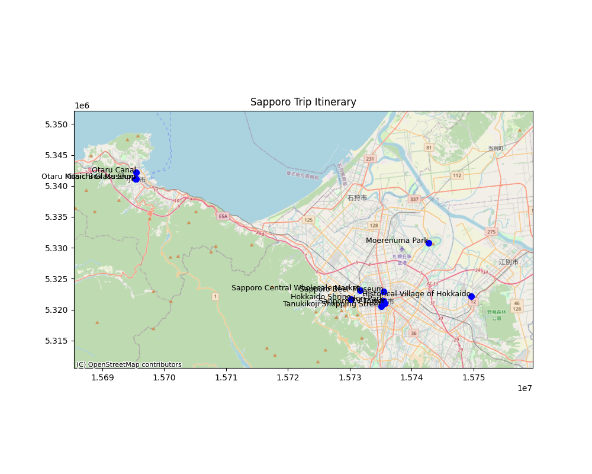

# 5-Day Trip Itinerary to Sapporo, Japan

## Introduction
This itinerary is designed for a 5-day trip to Sapporo, Japan, focusing on sightseeing and food. The trip includes a mix of historical and cultural exploration, nature and scenic spots, a day trip to Otaru, and shopping.

## Itinerary Table
| Order of Visit | Place                        | Latitude   | Longitude   | Transport                                                                 | Description                                                                 |
|----------------|------------------------------|------------|-------------|--------------------------------------------------------------------------|-----------------------------------------------------------------------------|
| 1              | Odori Park                   | 43.0618° N | 141.3545° E | Walk from Sapporo Station (approx. 10 minutes) or take the Namboku Line   | Start with a leisurely walk in the park.                                    |
| 2              | Sapporo TV Tower             | 43.0594° N | 141.3563° E | Walk from Odori Park (approx. 5 minutes)                                  | Head to the tower for a panoramic view of the city.                         |
| 3              | Hokkaido Shrine              | 43.0639° N | 141.3073° E | Take the Tozai Line to Maruyama Koen Station, then walk (approx. 15 mins) | Visit the shrine in the morning.                                            |
| 4              | Historical Village of Hokkaido | 43.0667° N | 141.4811° E | Take the JR Hakodate Line to Shinrin-Koen Station, then bus/taxi (10 mins) | Explore the open-air museum in the afternoon.                               |
| 5              | Moerenuma Park               | 43.1236° N | 141.4194° E | Take the Toho Line to Kanjo-Dori-Higashi Station, then bus/taxi (15 mins) | Spend the morning exploring the park.                                       |
| 6              | Sapporo Beer Museum          | 43.0720° N | 141.3542° E | Take the Toho Line to Higashi-Kuyakusho-Mae Station, then walk (10 mins)  | Visit the museum in the afternoon.                                          |
| 7              | Otaru Canal                  | 43.1980° N | 140.9947° E | Take the JR Hakodate Line to Otaru Station, then walk (approx. 10 mins)   | Start with a walk along the canal.                                          |
| 8              | Otaru Music Box Museum       | 43.1914° N | 140.9944° E | Walk from Otaru Canal (approx. 10 minutes)                                | Visit the museum next.                                                      |
| 9              | Kitaichi Glass Shop          | 43.1911° N | 140.9942° E | Walk from Otaru Music Box Museum (approx. 5 minutes)                      | End with a visit to the glass shop.                                         |
| 10             | Sapporo Central Wholesale Market | 43.0731° N | 141.3194° E | Take the Tozai Line to Nijuyon-Ken Station, then walk (approx. 10 mins)   | Visit the market in the morning.                                            |
| 11             | Tanukikoji Shopping Street   | 43.0564° N | 141.3505° E | Take the Tozai Line to Odori Station, then walk (approx. 5 mins)          | Spend the afternoon shopping.                                               |
| 12             | New Chitose Airport          | N/A        | N/A         | Take the Namboku Line to Sapporo Station, then JR Rapid Airport train     | Transfer to the airport for departure.                                      |

## Map

## Detailed Itinerary

### Day 1: Arrival and Initial Exploration
- **Odori Park**: Start with a leisurely walk in the park.
- **Sapporo TV Tower**: Head to the tower for a panoramic view of the city.

### Day 2: Historical and Cultural Exploration
- **Hokkaido Shrine**: Visit the shrine in the morning.
- **Historical Village of Hokkaido**: Explore the open-air museum in the afternoon.

### Day 3: Nature and Scenic Spots
- **Moerenuma Park**: Spend the morning exploring the park.
- **Sapporo Beer Museum**: Visit the museum in the afternoon.

### Day 4: Day Trip to Otaru
- **Otaru Canal**: Start with a walk along the canal.
- **Otaru Music Box Museum**: Visit the museum next.
- **Kitaichi Glass Shop**: End with a visit to the glass shop.

### Day 5: Shopping and Departure
- **Sapporo Central Wholesale Market**: Visit the market in the morning.
- **Tanukikoji Shopping Street**: Spend the afternoon shopping.
- **New Chitose Airport**: Transfer to the airport for departure.
